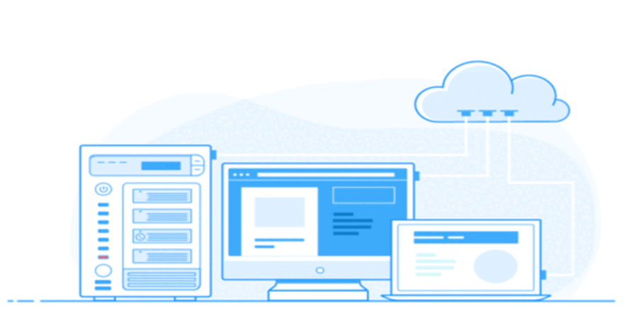

  ```
## Money Da Vinci Web App Outage Postmortem (April 13, 2024) 

## Issue Summary 

On Saturday, April 13th, 2024, a portion of Money Da Vinci web app users experienced slow loading times and error messages for approximately 1 hour and 15 minutes (14:15 CAT - 15:30 CAT). This postmortem outlines the root cause of the outage ️‍♀️, the corrective actions taken ️, and preventative measures implemented to minimize the risk of similar incidents in the future ️.

## Timeline 

* **14:15 CAT:** User reports of slow loading times and error messages begin ⚠️.
* **14:20 CAT:** Monitoring alerts indicate increased API response times .
* **14:20 - 14:45 CAT:** Initial investigation suspects user traffic surge. Scaling attempts are unsuccessful ➡️➡️.
* **14:45 CAT:** Database connection issue identified ❌.
* **14:45 - 15:15 CAT:** Database service restart and temporary cache layer implementation .
* **15:15 CAT:** Performance recovery, user reports subside .
* **15:30 CAT:** Web app fully functional ✅.

## Root Cause and Resolution 🩺

The root cause of the outage was a malfunctioning database connection pool. The pool, responsible for managing connections between the web app and the database, became overloaded and couldn't allocate new connections promptly. This bottleneck caused slow response times and errors for users .

The issue was resolved by restarting the database service, which cleared the connection pool and allowed it to function normally. Additionally, a temporary cache layer was implemented to reduce the number of database calls required for certain functionalities, further alleviating the load  ️➡️.

## Corrective and Preventative Measures 

* **Database Connection Pool Management:**
    * Review and adjust connection pool configuration to handle higher loads .
    * Implement connection pool monitoring for proactive identification of potential issues .
* **Redundancy:**
    * Implement primary-secondary database replication or leverage cloud-based redundancy features for high availability  .
* **Enhanced Monitoring:**
    * Include database connection pool metrics and health checks in monitoring for early warnings 🩺. 
* **Automated Scaling:**
    * Explore automated scaling for the web app and database to handle traffic fluctuations more efficiently .
* **Regular Code Reviews and Testing:**
    * Integrate code reviews and performance testing into the development process to identify and address potential bottlenecks before they cause outages .

## Conclusion 

This postmortem serves as a valuable learning experience. By implementing the corrective and preventative measures outlined above, we are committed to ensuring a more robust and reliable Money Da Vinci web app for our users. We appreciate your understanding and continued trust .